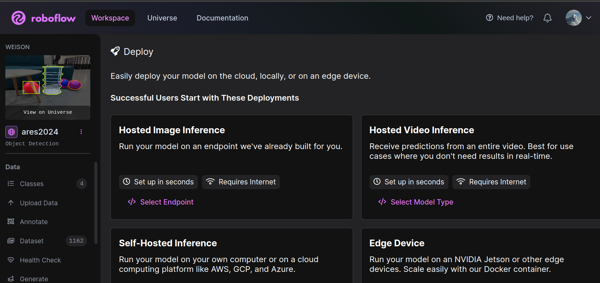
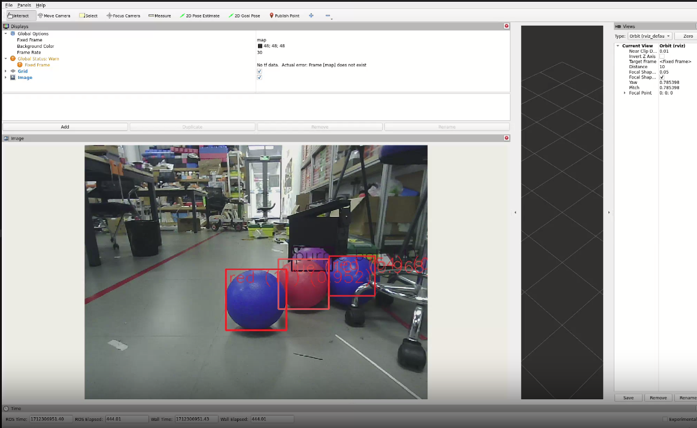
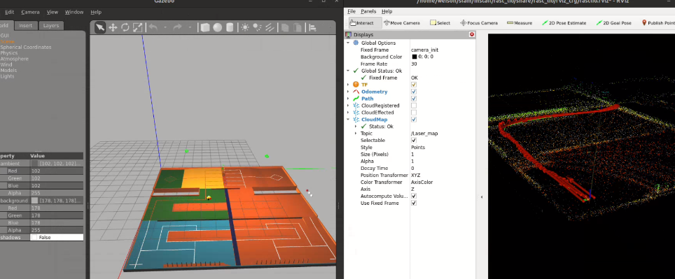
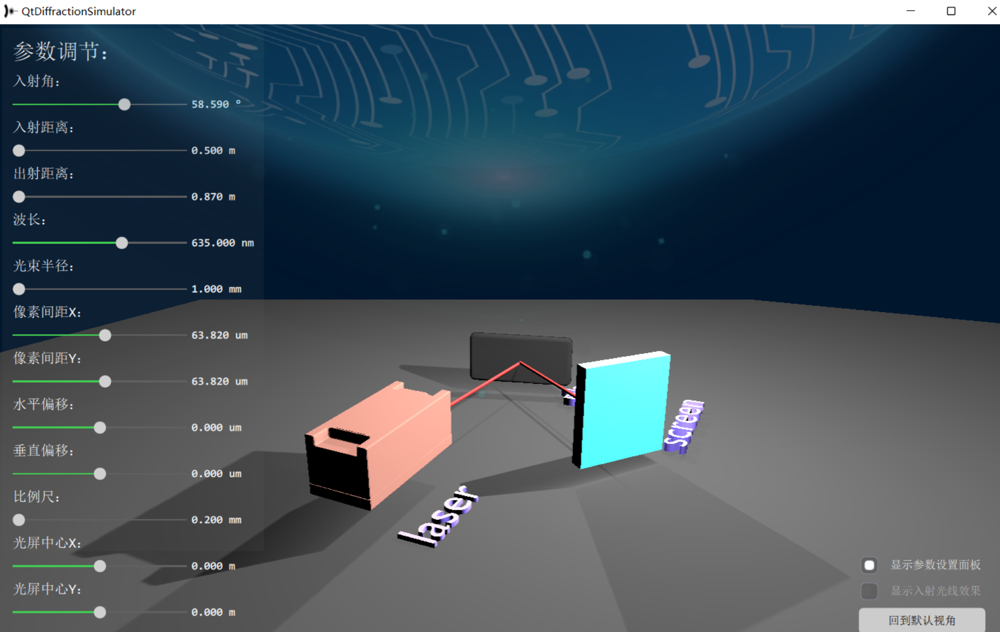

# 个人项目科研经历

---
## Robocon 2024 全国机器人大赛 
**算法组组长**
- 使用 ``ROS2``，``C++``，``python``单独完成全自动机器人视觉系统的代码编写，完成小球和球框目标识别
- 在roboflow平台上，单独完成小球球框的数据集的收集和制作，数据集[地址](https://app.roboflow.com/weison/ares2024/deploy)

- 使用自制的数据集（4 classes, 1162 pictures），训练   ___yolov8___ 模型，完成在jetson orin nx平台上部署, 并且使用 ___deepSORT___,完成小球目标追踪，模型在杰瑞微通120帧摄像机上，基本没有误识别，目标追踪稳定

- 基于Docker容器开发视觉系统，基于``Dockerfile``和``devcontainer.json``实现一键部署
- 在blender上完成3D场地的建模，并导出dae文件，完成Gazebo场地导入
- 使用opencv的``dnn``模块，完成在jetson orin nx下yolov8的部署，并使用cuda和onnxruntime加速
- 在Gazebo上使用 ___fastlio___,___icp___, ___navigation2___ 等算法和决策框架的使用,进行比赛的仿真（开发中）

- 实际场地中的定位和决策实机部署（开发中，机械组还没有完成机器人制作）

**电控组成员**
- 使用大疆RobomasterC板 (STM32F407) 的板载imu模块BMI088，部署EKF算法，完成底盘精准角度控制
- 完成大疆RobomasterA板 (STM32F427) FreeRTOS下的SD卡驱动开发，实现实时调度系统下SD日志模块的开发
- 使用完成STM32F407和linux上位机的通信，使用了CRC(使用32位长)校验，实现稳定通讯
- 使用位置式PID，增量式PID，抗饱和PID完成Robomaster电机底盘运动的控制
- 实现不同电脑间的以太网通信，ssh通信

# 南方科技大学人体增强实验室实验室
## 基于视觉反馈的电刺激系统的开发
> 项目地址：https://github.com/WeisonWEileen/yolo_mediapipe
- 一篇基于视觉反馈的电刺激康复系统会议论文，二作在投
- 在linux平台下使用 ``opencv``,``yolov8``,``mediapipe``,``python``单独完成视觉反馈系统的开发
- 完成各手掌关键点和日常生活常见物体的稳定测距,完成抓取运动的FSM编写
- 使用 ``mediapipe`` 完成手部三维模型的实时可视化绘制
- 使用``Dockerfile``完成一键项目部署
- 辅助电刺激控制代码调试

### 基于facebook的detectron2完成软物质抓握检测
- 使用python和官方预训练好的模型
- 使用detectron2的进行软物体进行像素分割，提取面积，根据面积判断是否成功

# 全国物理实验竞赛二等奖
>项目地址：https://github.com/Jupiter2143/QtDiffractionSimulator
- 利用Qt框架设计UI，实现3D模型交互
- 使用c++和qml语言进行编程
- 单独负责qt开发，动画实现，和物理引擎开发的同学合作，实现友好的人机交互界面

# 课程项目
### 使用open3D进行点云匹配
实现icp点云粗匹配然后精匹配

### java课程斗兽棋项目开发
- 使用java进行开发
- 负责GUI编写，socket通信编写，棋盘状态机编写
- 和另一位同学合作，成为全班唯一拿满bonus的组

# 正在开发
- Robocon 2024 全自动机器人仿真框架和决策树搭建
- 计算机视觉课程项目：SIFT特征图像匹配，基于Tranformer的图像分割应用
- 自主机器人系统：车轮沉陷的点云检测
