# 个人项目科研经历


---
###  强化学习半人马系统: 研究和开发中
基于 ```legged_gym``` human-robot interaction reinforcement learning.
- network design
- isaac gym 到 mujoco 的 sim2sim。
- legged gym Reinforcment Learning 训练。
- 机械设计。

<div style="text-align: center;">
	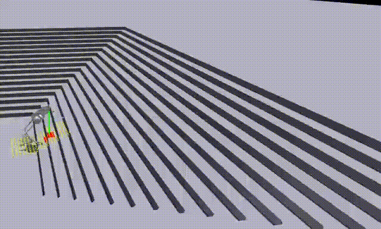
</div>

---

#### Depth-Anything 深度估计模型加速
> 项目地址：https://github.com/WeisonWEileen/depthanythingv2-onnxruntime-cpp-inference
- 使用 **onnxruntime** 对作者提供的4个 checkpoint 完成模型加速部署
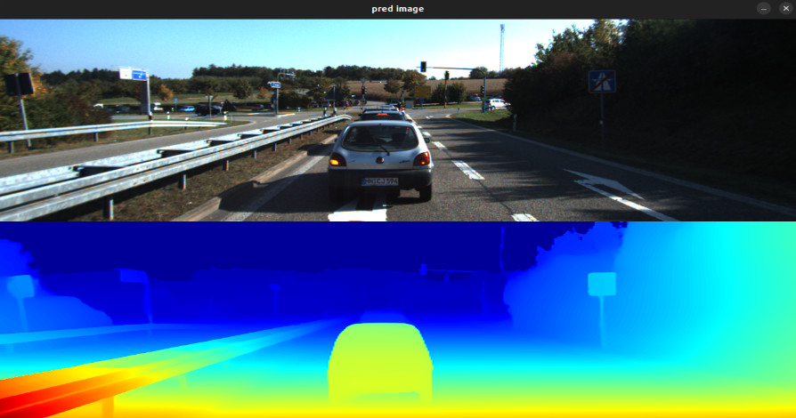

---

### imitation learning for maniplation 
基于 ``libero`` ``robosuite`` ``mujoco`` 二次开发。完成多个视角数据集接口设计编写

> github：https://github.com/WeisonWEileen/libero_pro/tree/master/my-libero


<div style="text-align: center;">
	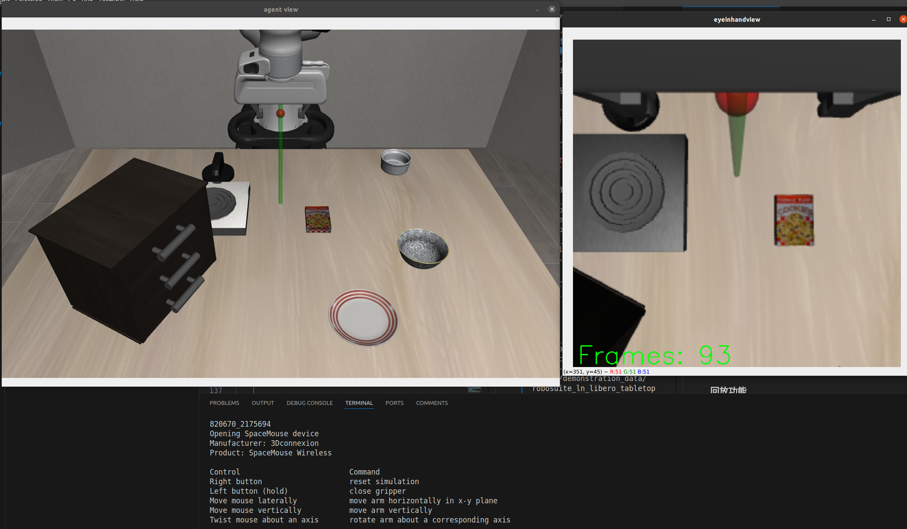
</div>
---

### Robocon 2025 
> **算法组组长** 负责给新人培训, 算法 on developing
> **机械组** 负责发球机构设计 on developing


<div style="text-align: center;">
	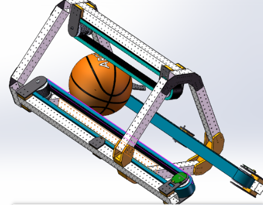
</div>


---
### dbscan based pointcloud clustering
利用 orb-slam 输出的特征点地图，进行点云聚类。
- dbscan algorithm implementation 
- octree-tree building.
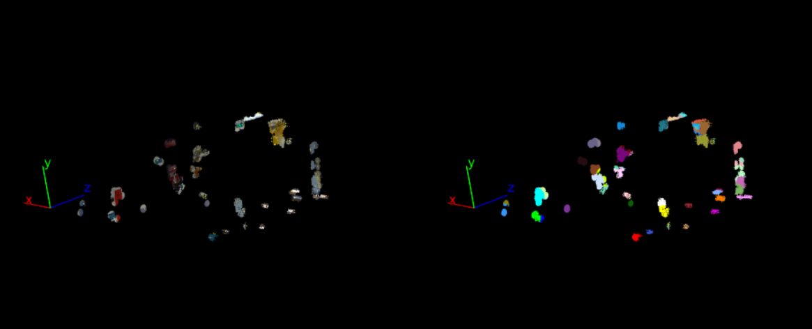


---
### FPGA全国大学生创新设计大赛二等奖
负责上位机的编写和使用 ResNet 3D 识别手势。

> 可视化的项目地址： https://github.com/WeisonWEileen/pyqt-touching-show
> ResNet-3D: on developing:https://github.com/WeisonWEileen/AIM-skin


<div style="text-align: center;">
	
</div>


---
### Robocon 2024 
> Robocon 2024 全国机器人大赛主赛二等奖(算法组组长)
> Robocon 2024 2024全国机器人大赛技能挑战赛一等奖

<table>
  <tr>
    <td style="text-align: center;">
      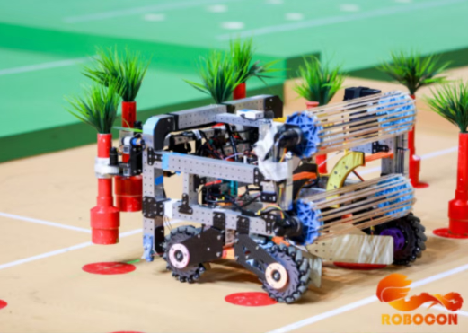
    </td>
    <td style="text-align: center;">
      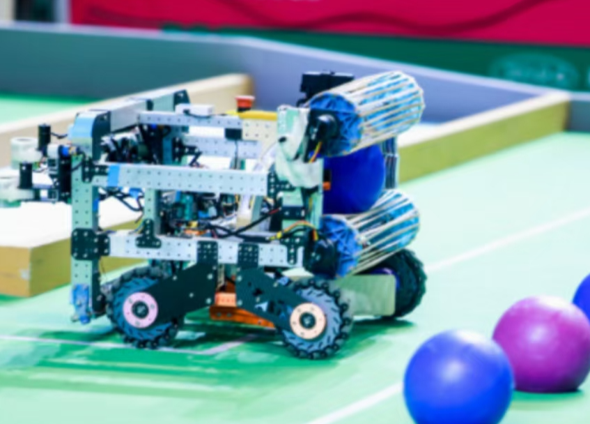
    </td>
  </tr>
</table>
<table>
  <tr>
    <td style="text-align: center;">
      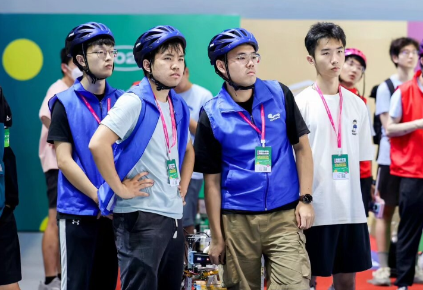
    </td>
    <td style="text-align: center;">
      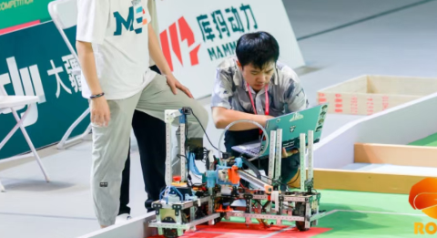
    </td>
  </tr>
</table>


**算法组组长**
- 使用 ``ROS2``，``C++``，``python``单独完成全自动机器人视觉系统的代码编写，完成小球和球框目标识别
- 在roboflow平台上，单独完成小球球框的数据集的收集和制作，数据集[地址](https://app.roboflow.com/weison/ares2024/deploy)
<div style="text-align: center;">
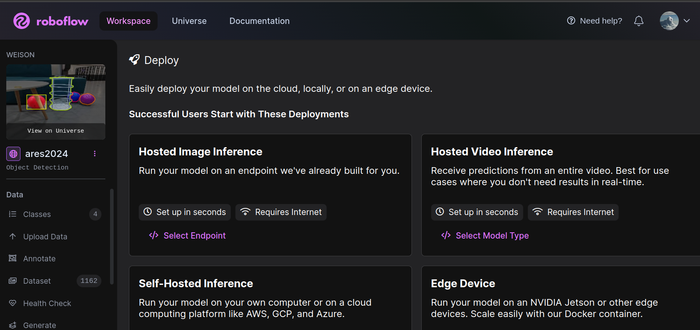
</div>

- 使用自制的数据集（4 classes, 1162 pictures），训练   ___yolov8___ 模型，完成在jetson orin nx平台上部署, 并且使用 ___deepSORT___,完成小球目标追踪，模型在杰瑞微通120帧摄像机上，基本没有误识别，目标追踪稳定
<div style="text-align: center;">
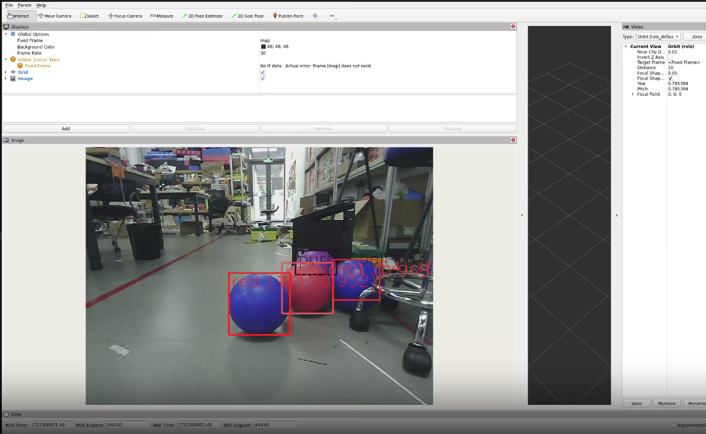
</div>

- 基于Docker容器开发视觉系统，基于``Dockerfile``和``devcontainer.json``实现一键部署
- 在blender上完成3D场地的建模，并导出dae文件，完成Gazebo场地导入
- 使用opencv的``dnn``模块，完成在jetson orin nx下yolov8的部署，并使用cuda和onnxruntime加速

- 在Gazebo上使用 ``fastlio``,```icp```,```navigation2``` 等算法和决策框架的使用,进行比赛的仿真
<div style="text-align: center;">
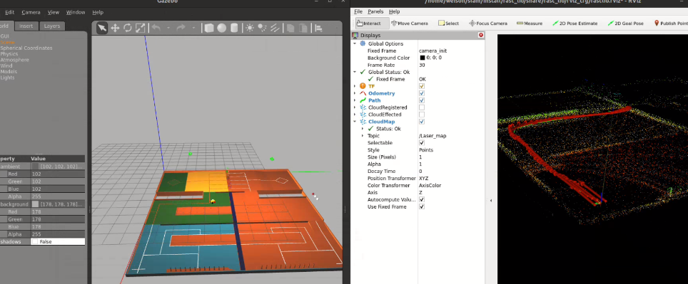
</div>
- 实际场地中的定位和决策实机部署（开发中，机械组还没有完成机器人制作）


**电控组成员**
- 使用大疆RobomasterC板 (STM32F407) 的板载imu模块BMI088，部署EKF算法，完成底盘精准角度控制
- 完成大疆RobomasterA板 (STM32F427) FreeRTOS下的SD卡驱动开发，实现实时调度系统下SD日志模块的开发
- 使用完成STM32F407和linux上位机的通信，使用了CRC(使用32位长)校验，实现稳定通讯
- 使用位置式PID，增量式PID，抗饱和PID完成Robomaster电机底盘运动的控制
- 实现不同电脑间的以太网通信，ssh通信
---
<!-- # 南方科技大学人体增强实验室 -->
### 基于视觉反馈的电刺激康复系统的开发和研究(ICARM 2024)
> 论文地址: https://ieeexplore.ieee.org/document/10715888
> 上位机项目地址：https://github.com/WeisonWEileen/yolo_mediapipe
- 一篇基于视觉反馈的电刺激康复系统会议论文，二作在投
- 在linux平台下使用 ``opencv``,``yolov8``,``mediapipe``,``python``单独完成视觉反馈系统的开发
- 完成各手掌关键点和日常生活常见物体的稳定测距,完成抓取运动的FSM编写
- 使用 ``mediapipe`` 完成手部三维模型的实时可视化绘制
- 使用``Dockerfile``完成一键项目部署
- 辅助电刺激控制代码调试


<table>
  <tr>
    <td style="text-align: center;">
      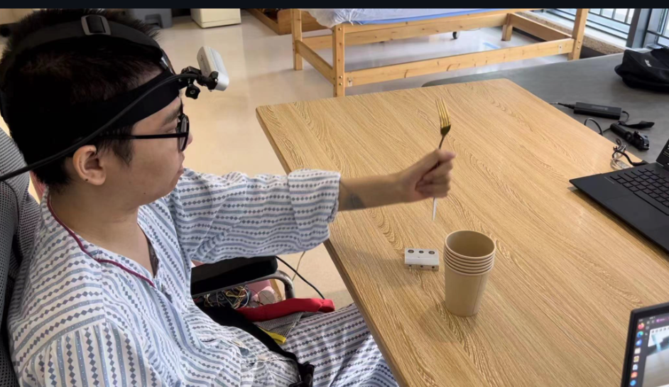
    </td>
    <td style="text-align: center;">
      
    </td>
  </tr>
</table>


### 基于imu的电刺激康复系统的开发和研究(ICARM 2024)
辅助实验
> 论文地址： https://ieeexplore.ieee.org/document/10715889


### 基于facebook的detectron2完成软物质抓握检测
- 使用python和官方预训练好的模型
- 使用detectron2的进行软物体进行像素分割，提取面积，根据面积判断是否成功
<div style="text-align: center;">

</div>

### 全国物理实验竞赛二等奖
>项目地址：https://github.com/Jupiter2143/QtDiffractionSimulator
- 利用Qt框架设计UI，实现3D模型交互
- 使用c++和qml语言进行编程
- 单独负责qt开发，动画实现，和物理引擎开发的同学合作，实现友好的人机交互界面
<div style="text-align: center;">
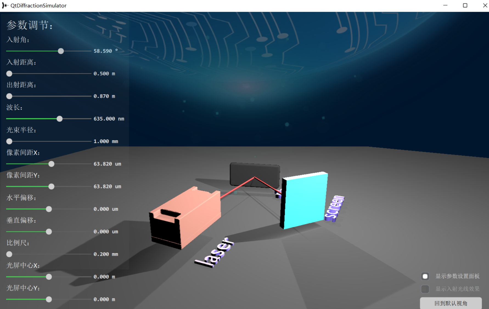
</div>


<!-- # 课程项目
### 使用open3D进行点云匹配
实现icp点云粗匹配然后精匹配

### java课程斗兽棋项目开发
- 使用java进行开发
- 负责GUI编写，socket通信编写，棋盘状态机编写
- 和另一位同学合作，成为全班唯一拿满bonus的组 -->